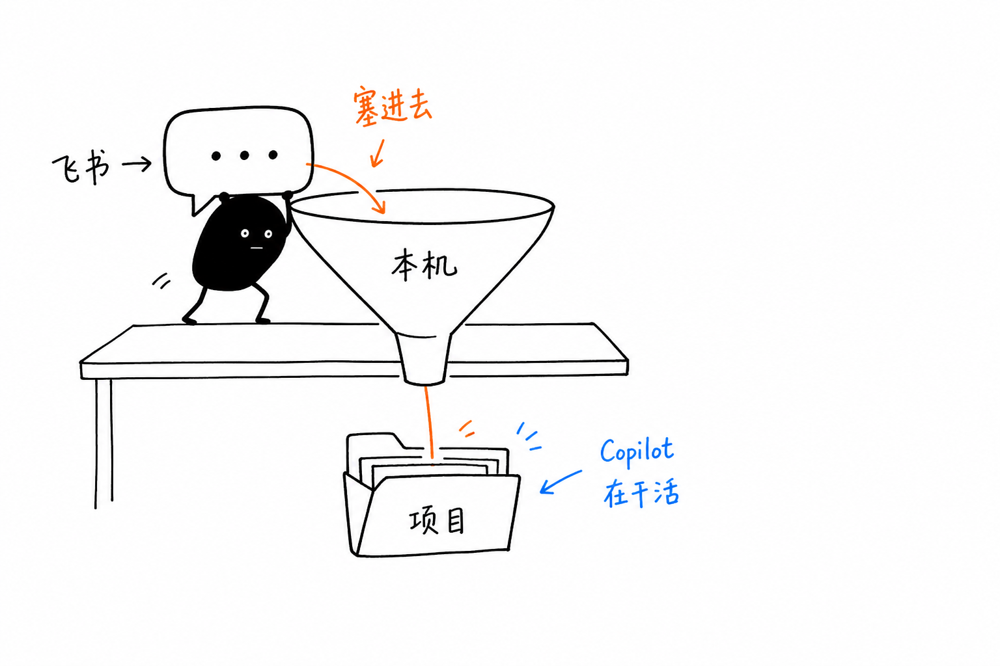
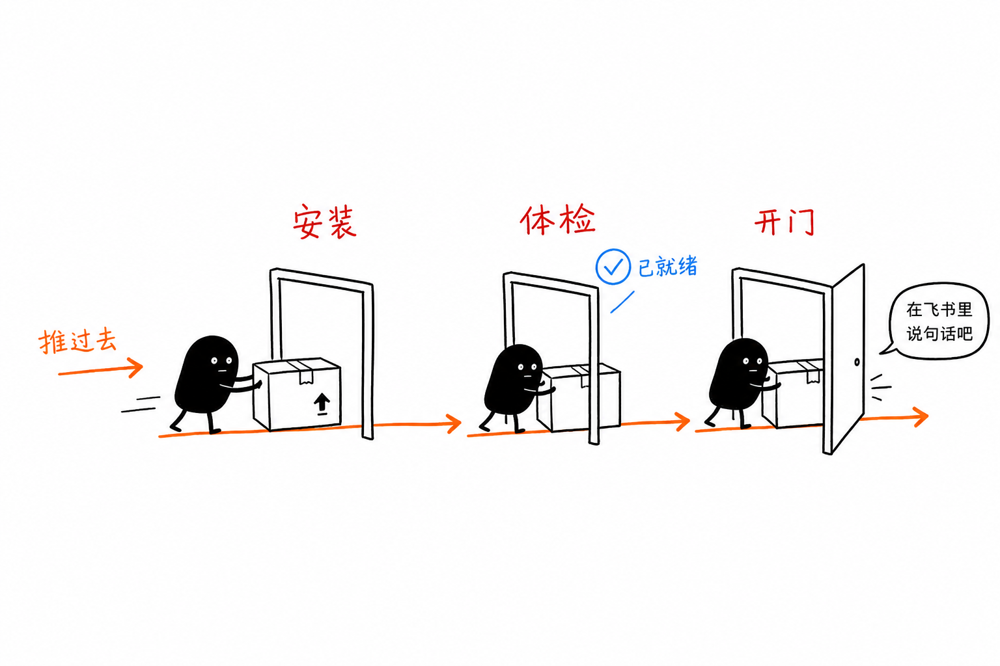
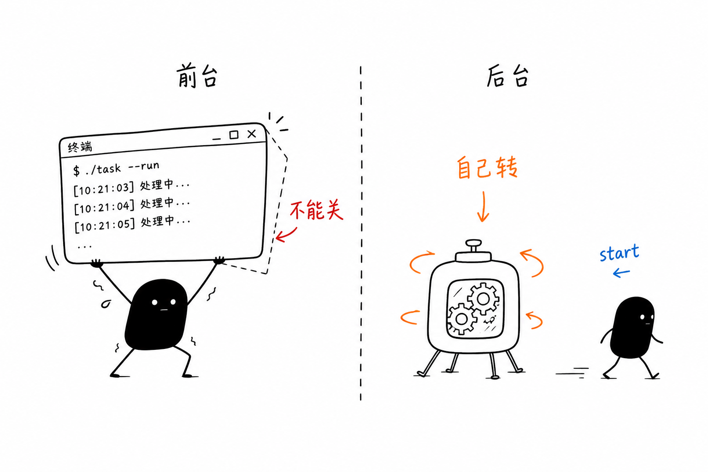

# 飞书里用上本地 Copilot

给「不太写代码也能上手」的图文指南。  
命令速查请看 [README](../README.md)。

---

## 这是什么

`lark-copilot-bridge` 把两件事接在一起：

- 你在 **飞书** 里打字、发图、发文件
- 本机上的 **GitHub Copilot CLI** 在你指定的文件夹里读文件、改代码

回复写在**同一张流式卡片**上：思考、工具调用、正文会原地更新。



你不必会写代码。机器人跑在**你自己的电脑**上——飞书只是遥控器。电脑休眠或关机，机器人也会停。

---

## 先准备四样东西

1. 一台 Mac / Windows / Linux（机器人就跑在这台机器上）
2. [Node.js 20+](https://nodejs.org/)
3. GitHub Copilot 订阅，并装好 CLI（建议 ≥ 1.0.49，卡片才能显示工具调用）：

```bash
curl -fsSL https://gh.io/copilot-install | bash
copilot
```

按提示登录 GitHub；登录成功后可关掉这个窗口。

4. 手机飞书（用来扫码创建机器人）

---

## 三步开始用

每步只干一件事：**装到电脑 → 打勾体检 → 拧开启动**。



### ① 安装

```bash
npm install -g github:ma345564280/lark-copilot-bridge
```

或：

```bash
curl -fsSL https://raw.githubusercontent.com/ma345564280/lark-copilot-bridge/main/scripts/install.sh | bash
```

请用**全局安装**。后面若要 `start` 后台常驻，不要用 `npx … start`——守护进程会记下临时缓存路径，缓存一清就挂。

### ② 体检（推荐）

```bash
lark-copilot-bridge doctor
```

先看 Node / Copilot 是不是 ✓。第一次启动前，飞书绑定、项目文件夹可能还是 ⚠，属正常；按提示的「→」处理即可。

### ③ 启动（第一次请先前台）

**第一次必须前台跑一遍**，才能扫码、选文件夹、选谁能用：

```bash
lark-copilot-bridge
```

按提示依次完成：

1. **手机飞书扫二维码**（创建机器人，只需一次）
2. **项目文件夹**（Copilot 只能动这个目录里的文件；Mac 可把文件夹拖进终端）
3. **谁能用**（推荐「仅我自己」）

终端出现「已就绪」后：打开飞书，搜它显示的机器人名称，**私聊**发一句「你好」试一下。

> `lark-copilot-bridge start` **不会**带你扫码。没绑定、没选好文件夹时直接 `start` 会失败，并提示你先跑前台或 `setup`。

---

## 想关掉终端也在线？改成后台常驻

飞书已经能聊之后，再装成系统服务（推荐日常用法）：

```bash
lark-copilot-bridge start
lark-copilot-bridge status
```

| 方式 | 命令 | 特点 |
|---|---|---|
| 前台 | `lark-copilot-bridge` | 终端窗口必须一直开着 |
| 后台常驻 | `lark-copilot-bridge start` | 关掉终端也在线；开机/登录后可自动起来 |



常用：`stop` 停止并取消自启，`restart` 重启，`unregister` 清掉服务注册（保留配置）。

想改文件夹或权限：

```bash
lark-copilot-bridge setup
```

若当时正用着后台常驻，改完后执行一次 `lark-copilot-bridge restart`，新设置才会生效。

---

## 在飞书里怎么聊

- **私聊**：直接发
- **群聊**：必须 **@机器人**，否则听不见
- **图片 / 文件**：直接发（群聊同样要 @）；会先下到本机再交给 Copilot
- **看进度**：同一张卡片更新思考 / 工具 / 正文（不是连发很多条气泡）
- **停下**：点卡片上的「终止」，或发 `/stop`
- **新话题**：`/new`
- **看状态**：`/status`（本机全局信息仅管理员可见）
- **看命令**：`/help`
- **换项目文件夹**：`/cd 路径`（管理员）
- **命名工作目录**：`/ws`（管理员；详见 README）

选了「仅我自己」时，你就是管理员，上面这些都能用。


若 `doctor` 提示不支持 json 输出，卡片会降级为纯文本流式（看不到工具块）。升级 Copilot CLI ≥ 1.0.49 即可。

---

## 安全：只给自己，只动一个项目

这个机器人能指挥 **你这台电脑** 上的 Copilot 改文件。请记住三件事：


1. 设置里选 **「仅我自己」**
2. 不要把机器人拉进陌生人可见的群（即使限制了使用者，群里仍可能看到回复内容）
3. 项目文件夹选**具体工程目录**，不要选整个用户主文件夹

---

## 卡住了？

- **飞书没反应**：群聊是否 @ 了？前台模式终端是否还开着？用了 `start` 就跑 `lark-copilot-bridge status`；也可看 `~/.lark-copilot-bridge/logs/` 下的日志
- **`start` 失败说还没绑定**：先跑一次 `lark-copilot-bridge` 或 `setup` 完成扫码与选目录
- **提示没有 Copilot**：终端跑 `copilot` 登录；确认订阅有效
- **改错文件夹**：`setup` 重选；后台模式下再 `restart`
- **换电脑**：新电脑重新安装并扫码；或拷贝 `~/.lark-copilot-bridge/config.json`（高级）
- **换飞书机器人**：`lark-copilot-bridge logout`，再前台启动重新扫码

更多命令与进阶配置见 [README](../README.md)。

---

## 插画说明

正文配图采用「小黑」怪诞手绘风格，生成流程参考开源 Skill  
[ian-xiaohei-illustrations](https://github.com/helloianneo/ian-xiaohei-illustrations)（MIT）。
